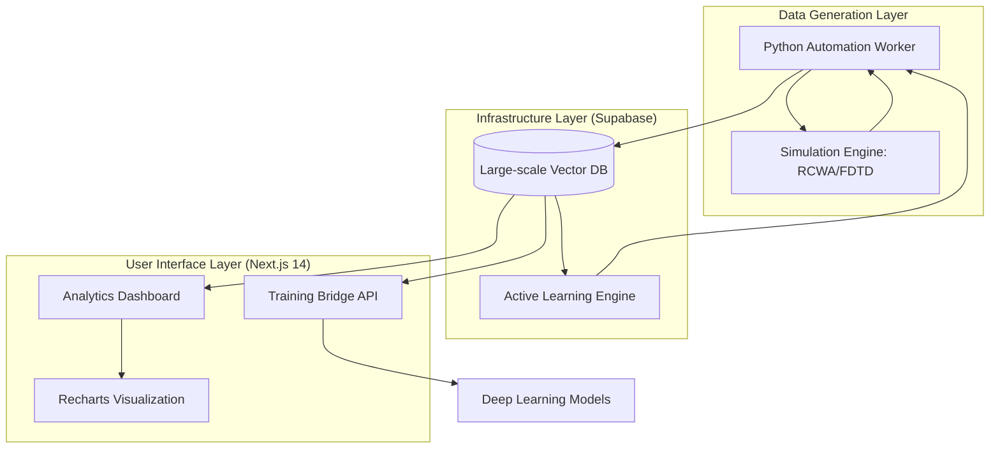

# [Research Report] Meta-Atom Dataset Factory: 대규모 메타-원자 데이터셋 생성 및 자동화 파이프라인 구축 🚀

<div align="center">
  
  <p>Job Queue 기반의 대규모 시뮬레이션 자동화 및 생성된 데이터셋의 품질 지표(Quality Metrics)를 실시간으로 모니터링하는 통합 대시보드 구동 화면입니다.</p>
</div>

## 1. Research Motivation & Necessity
차세대 메타렌즈(Metalens) 및 홀로그램 장치 설계를 위한 **메타표면 역설계(Metasurface Inverse Design)** 모델의 성능은 학습 데이터셋의 질과 양에 의해 결정된다. 그러나 기존의 메타-원자(Meta-atom) 데이터 확보 방식은 다음과 같은 치명적인 한계를 가진다.

- **Simulation Bottleneck**: 수동으로 파라미터를 입력하고 시뮬레이션 결과를 취합하는 전통적인 방식은 기하급수적으로 증가하는 디자인 공간(Design Space)을 탐색하기에 비효율적이다.
- **Data Scarcity within High-Gradient Regions**: 무작위 샘플링 기반의 데이터셋은 물리적 응답이 급격히 변하는 영역(High-gradient regions)에서 충분한 밀도를 확보하지 못해 모델의 일반화 성능을 저하시킨다.

본 프로젝트는 이러한 병목 현상을 해결하기 위해 **고객 맞춤형 데이터 생성 자동화 팩토리(Automation Factory)**를 구축했다. 이를 통해 연구자는 수만 건의 고정밀 데이터를 최소한의 인간 개입으로 확보하며, AI Surrogate 모델 학습을 위한 고해상도 물리적 응답 분포를 효율적으로 구축할 수 있다.

---

## 2. Data Generation Methodology

본 시스템은 데이터의 정보 획득 효율(Information Gain)을 극대화하기 위해 다음과 같은 고도화된 샘플링 및 시뮬레이션 제어 전략을 채택한다.

### 2.1 Multi-Dimensional Parameter Sampling
- **Latin Hypercube Sampling (LHS)**: 기하학적 파라미터(Unit-cell Size, Height, Width, Material property) 간의 독립성을 보장하면서도 디자인 공간을 균일하게 커버하기 위한 LHS 전략을 기본으로 사용한다.
- **Active Learning-based Adaptive Refinement**: 기존 데이터셋의 전자기적 응답 분석을 통해 학습 오차가 높거나 데이터 밀도가 낮은 '희소 구간(Sparse Regions)'을 자동 탐지하며, 해당 영역에 집중적인 추가 시뮬레이션을 배치하는 능동 학습 루프를 지원한다.

### 2.2 Automated Simulation Integration (RCWA/FDTD)
- Python 기반의 자동화 스크립트(`worker.py`)가 시뮬레이션 엔진(RCWA/FDTD)과 실시간 연동되어 광학적 응답을 추출한다.
- **Extracted Metrics**: Transmission(투과율), Phase(위상 변이), S-parameters(S-파라미터) 등의 핵심 물리량을 정규화하여 데이터베이스에 적재한다.

---

## 3. System Architecture

대량의 시뮬레이션 데이터를 효율적으로 관리하고 시각화하기 위해 Full-stack 데이터 엔지니어링 아키텍처를 설계했다.



- **Large-scale Data Management**: Supabase(PostgreSQL)를 활용하여 수만 개의 메타-원자 데이터를 관리한다. 특히 파라미터 검색 가속화를 위해 복합 인덱스(Composite Index) 및 GIN Index를 적용하여 쿼리 성능을 최적화했다.
- **QA Dashboard**: Next.js 14 환경에서 `Recharts` 라이브러리를 통해 파라미터 간 상관관계 및 데이터 분포를 시각화하여 생성된 데이터의 무결성을 검증한다.

---

## 4. Key Features & Use-cases

### 4.1 Dataset Diversity Analysis
단순 데이터 적재를 넘어 생성된 데이터가 학습에 적합한 다양성을 갖추었는지 실시간 분석한다.
- **Correlation Mapping**: 기하 구조와 위상 변이 간의 비선형적 관계를 산점도(Scatter Plot) 및 히트맵(Heatmap)으로 분석한다.
- **Anomaly Detection**: 시뮬레이션 중 발생하는 물리적 이상치(Outliers)를 사전에 필터링하여 데이터셋의 신뢰도를 확보한다.

### 4.2 Deep Learning Ready Pipeline
본 플랫폼에서 생성된 데이터는 전처리 과정 없이 즉시 인공지능 모델 학습에 투입 가능하다.
- **Training Bridge Service**: CNN/MLP 모델 입력을 위한 데이터 정규화(Normalization), 데이터 증강(Augmentation), 그리고 CSV/JSON 익스포트 기능을 제공한다.
- **API-based Integration**: Next.js API Routes를 통해 Python PyTorch/TensorFlow 환경에서 데이터셋을 직접 페칭(Fetching)할 수 있는 학습 파이프라인을 구축했다.

---

## 5. Implementation & Setup

### Requirements
- **Runtime**: Python 3.10+, Node.js 18+
- **Database**: Supabase Account
- **Simulation**: RCWA/FDTD Engine access (integrated via Python SDK)

### Quick Start
1. **Repository Clone & Dependencies**:
   ```bash
   git clone https://github.com/haeseong-kwon/meta-atom.git
   cd meta-atom
   npm install
   pip install -r requirements.txt
   ```
2. **Environment Configuration**:
   `.env` 파일에 Supabase 접속 정보를 설정한다.
3. **Data Generation Start**:
   ```bash
   python worker.py  # 시뮬레이션 및 데이터 수집 시작
   npm run dev       # 분석 대시보드 실행
   ```

---

**Author**: 권해성 (Hanyang University, Computer Science)
**Research Interest**: Optical Dataset Engineering, Metasurface Deep Learning, Simulation Automation
